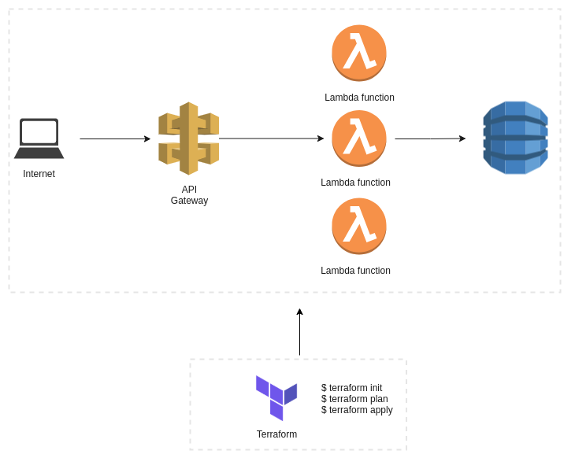

# Desafio Tecnologia TON

* Aplicação de gestão de funcionários.

## Descrição

* Módulo [Terraform](https://www.terraform.io/) para criação das funções Lambdas na linguagem Python ([AWS Lambda](https://aws.amazon.com/pt/lambda/)). 
* API REST com os métodos HTTP (POST, GET, DELETE) ([Amazon API Gateway](https://aws.amazon.com/pt/api-gateway/)).
* Banco de dados não relacional ([DynamoDB](https://aws.amazon.com/pt/dynamodb/)).

## Diagrama de Fluxo



## Requisitos

* [Terraform v0.14.8](https://www.terraform.io/downloads.html)

## Utilização do projeto

* Registro de funcionário

```sh
$ curl -X POST "https://j66g1ae0x0.execute-api.us-east-1.amazonaws.com/prod/employee" -H 'Content-Type: application/json' -d'
{
  "id": "1", 
  "name": "Joao", 
  "role": "Gerente", 
  "age": 30
}'
```
* Busca de funcionários

```sh
$ curl -X GET "https://j66g1ae0x0.execute-api.us-east-1.amazonaws.com/prod/employee"
```

* Exclusão de funcionários

```sh
$ curl -X DELETE "https://j66g1ae0x0.execute-api.us-east-1.amazonaws.com/prod/employee/" -H 'Content-Type: application/json' -d' 
{
  "id": "1"
}'
```

## Execução do projeto localmente

* Clone o repositório
```sh
$ git clone https://github.com/guilherme-mendes/tech-ton-challenge.git
$ cd tech-ton-challenge/terraform  
```

* Configure conta AWS
```sh
$ configure aws
```

* Execute o terraform
```sh
$ terraform init
$ terraform plan
$ terraform apply
```